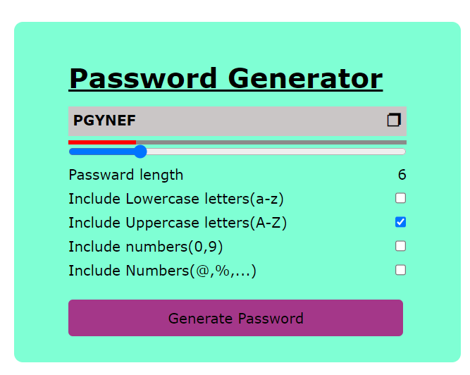

# Password Generator


## Table of Contents
- [Password Generator](#password-generator)
  - [Table of Contents](#table-of-contents)
  - [Description](#description)
  - [Features](#features)
  - [Screenshots](#screenshots)
  - [Installation](#installation)

## Description

The Password Generator is a simple utility that allows users to generate strong and secure passwords. It helps users create complex passwords with a mix of uppercase and lowercase letters, numbers, and special characters, enhancing the overall security of their accounts.

## Features

- Generates random passwords based on user preferences.
- Customizable password length.
- Options to include or exclude uppercase letters, lowercase letters, numbers, and special characters.
- User-friendly and intuitive interface.

## Screenshots




## Installation

1. Clone the repository:

   ```bash
   git clone https://github.com/eziraa/Password-Generator.git
